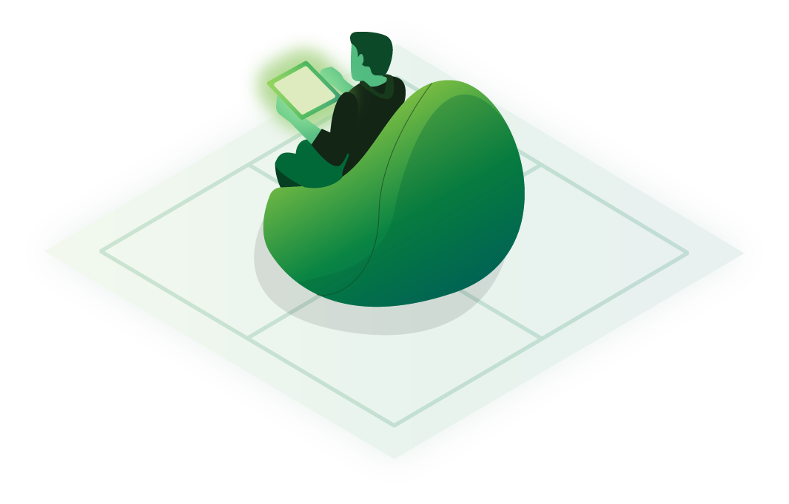
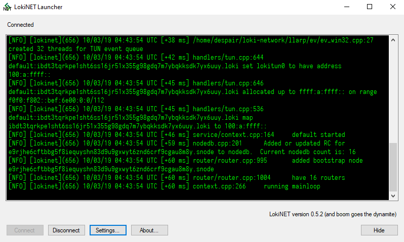

<link rel="stylesheet" type="text/css" href="https://www.loki.network/asciinema-player.css" />
<h2>紹介</h2>

    

        

            

                プライバシーとは、いつどのように個人情報を公開するかを決める能力です。人の個人情報は例がないほどに収集、保存されている現在の世界では、プライバシーは特に重要です。
                  
                Lokiは分散型のブロックチェーン技術を利用して、インターネットと新たな接続する方法を構築するによって、ユーザーに匿名に、そしてプライベートにオンラインで交流するためのツールを提供します。
            

        

        <h2>ダウンロード</h2>
        

            

                <h3>セッション</h3>
                

                    <a href="https://github.com/loki-project/loki-messenger/releases" class="button button-outline">デスクトップ</a>
                

                

                    <a href="https://github.com/loki-project/loki-messenger-android/releases" class="button button-outline">アンドロイド</a>
                

                

                    <a href="https://github.com/loki-project/loki-messenger-ios/releases" class="button button-outline">iOS</a>
                

                <h3>ウォレット</h3>
                

                    <a href="https://github.com/loki-project/loki-electron-gui-wallet/releases" class="button button-outline">GUI版</a>
                

                

                    <a href="https://github.com/loki-project/loki/releases" class="button button-outline">CLI版</a>
                

                

                    <a href="https://github.com/loki-project/loki-android-wallet/releases" class="button button-outline">アンドロイド版</a>
                

                

                    <a href="https://github.com/loki-project/loki-ios-wallet/releases" class="button button-outline">iOS版</a>
                

            

            

                <h3>Lokinet</h3>
                

                    <a href="https://github.com/loki-project/loki-network/releases" class="button button-outline">デスクトップ</a>
                

            

        

    

    

        
    

    <video width="1000" poster="assets/AssetsChina/thumbnail.PNG" controls>
    <source src="assets/AssetsChina/ChinaThisIsLokiHardSubs.webm"  type="video/webm">
        Your browser does not support the video tag.
    </video>

 

<h2 id="loki">Lokiとは？<a class="headerlink" href="#loki" title="Permanent link">&para;</a></h2>

LokiはTorと同じようなプライバシーソフトウェアです。オンライン活動をよりプライベートそして匿名にするという点で、Torに似ています。Lokiを使用すると、訪れるウェブサイトに追跡されにくくなり、端末からの接続も監視されにくくなります。  

そしてさらに、Torと同じように、Lokiには普通のインターネット（クリアネット）よりプライベートな内部ネットワーク（ダークネット）を持ちます。ユーザーがクリアネットよりプライベートなウェブサイトやチャットルームをLokiの内部ネットワークに作ることができます。  

Lokiには、プライバシーと匿名性を守るため自体の内部ネットワークを利用する「セッション」というメッセンジャーアプリもあります。  

<h2>LokiはTorと何が違いますか？</h2>

LokiはTorに似ていますが、1つの大きな違いがあります。LokiはTorの最大の問題を解決するために開発されました。まずはその問題を説明して、そしてLokiの解決策について述べましょう。  

TorとLoki両方は、正常に機能するために世界中のサーバー（ノード）が必要です。Torの場合、誰でもコストゼロでノードを管理できます。その良い点は、ノードの世界中の大型ネットワークを作りやすくなります。しかし逆に、その欠点は悪意のある人々でも簡単にノードを設定できてしまうことです。悪意のあるTorノードはユーザーたちを監視でき、ネットワークにダメージを与えれます。誰でも簡単にノードを設定できるからこそ、悪意のある人々が簡単に悪意ノードのネットワークも作れます。  

Lokiの場合、ノードの設定には一定の電子マネー（仮想通貨）の投資を必要とすることで問題を解決しようとしています。ノード管理者はまだ匿名のまま、そしてLokiはもちろんフリー・オープンソース・ソフトウェアですが、管理者はノードを設定する前に電子マネー（仮想通貨）の投資を固定しなければなりません。その後、管理者はノード運用と引き換えに電子マネー（仮想通貨）を稼ぐこともできます。  

Lokiに悪意ノードは作られることがまだできますが、ノードを設定するには投資が必要なので悪意ノードの大型ネットワークを簡単に作れません。つまり、ユーザーたちを監視し、ネットワークにダメージを与えることは難しくなります。その上、悪意ノード管理者が発見されたらネットワークから追い出されて、ノード運用で稼ぐことができなくなります。  

言い換えれば、ノード設定の財務コスト、そしてノード運用で稼ぐ可能性は悪意ノードの管理を思いとどまらせて、ネットワークに役立つ行為を助長します。  

<h2>Lokiは有料ですか？</h2>

いいえ。Lokiはフリー・オープンソース・ソフトウェアだからこそ、ユーザーは無料で使えます。ノード管理者のみは電子マネーについて考えなければなりません。  

    

        <h3>セッション</h3>
        

            
        

        

            セッション はオープンソース、公開鍵をもとにしたの安全なメッセンジャーアプリです。分散型の記憶サーバーそしてオニオンルーティングプロトコルによって、メタデータの暴露をできる限り防止しながら終端間暗号化されるメッセージを通信します。
        

    

    

        <h3>サービスノード</h3>
        

            
        

        

            サービスノードはLokinetの根幹を成します。その管理者は仮想通貨を稼ぐことができ、ユーザに様々なプライベートそして匿名なサービスへのアクセスを与えます。インターネットをよりプライベートにするし、もっと利益が出れるようにします。 
              
            <a href="https://github.com/loki-project/loki-docs/blob/master/docs/ServiceNodes/SNFullGuide.md"> 自分のサービスノードを管理したい方、このガイドを見て下さい。</a>
        

    
  
    

        <h3>Lokinet</h3>
        

            
        

        

            Lokinetは財政的に奨励された、管理者の存在しない定足数に基づく混合ネットワークです。ユーザーに匿名の、分散的で、安全な、そしてプライベートにオンラインで交流する能力を提供します。
              
            <a href="https://github.com/ChanoSan/loki-docs/blob/master/JP/Lokinet/LokinetOverview.md">詳しくはLokinet概要を見て下さい。</a>
        

    

    

        <h3>SNApps（サービスノードアプリ）</h3>
        

            
        

        

            SNAppsはサーバー側・ユーザー側両方の匿名性を維持しながら、市場・フォーラム・内部告発ウェブサイト・ソーシャルメディアをはじめとしたインターネットアプリケーションのホストとアクセスを可能にします。
              
            <a href="https://github.com/ChanoSan/loki-docs/blob/master/JP/Lokinet/Guides/HostingSNApps.md">自分のSNAppを作りたい方、このガイドを見て下さい。</a>
        

    
      

 
 

<h2 id="_1">セッション<a class="headerlink" href="#_1" title="Permanent link">&para;</a></h2>

    

        

            セッション はオープンソース、公開鍵をもとにしたの安全なメッセンジャーアプリです。中央型サーバーに頼らず、何千もの経済的に奨励された分散型ノードのネットワークをメッセージ交換の主な機能に使用します。
              
            分散型の記憶サーバそしてオニオンルーティングプロトコルによって、メタデータの暴露をできる限り防止しながら終端間暗号化されるメッセージを通信します。それに加えて、主流メッセンジャーアプリの共通の機能も提供します。
              
        

        
    

    

        
    

 
 

<h2 id="_2">サービスノード<a class="headerlink" href="#_2" title="Permanent link">&para;</a></h2>

    

        

            Lokinet上のサービスノードは低遅延のオニオンルーティングプロトコルを運用し、完全に分散されるオーバーレイネットワークを形成します。オニオンルーティングプロトコルは、ユーザを分散的ネットワークを介してトンネルや経路を形成することを可能にし、複数のノードを経由させてデータパケットのソースや行き先を隠ぺいします。サービスノードを運営するには仮想通貨の担保要件がありますが、ネットワークへストレージと帯域幅を与えることと引き換えに管理者は仮想通貨マイニングからのブロック報酬の一部を稼ぎます。
        

    

    

         
    

 
 

<h2 id="_3">Lokinet<a class="headerlink" href="#_3" title="Permanent link">&para;</a></h2>

    

        

            通Lokinetは信頼されている権威者に頼らずに、ブロックチェーンからステートを完全に得ます。ユーザは個々のサービスノードと接続でき、データパケットを転送するための双方向経路を形成できます。
              
            ネットワーク内部にホストされる様々なSNAppというサービスへもアクセスでき、サービスノードの出口機能を利用して、IPアドレスを公開せずに外部インターネットを閲覧できます。
              
            Windows、Linux、そしてMacの人気ブラウザ全てをサポートします。
        

    

    

         
    

 
 

<h2 id="_4">SNApp（サービスノードアプリ）<a class="headerlink" href="#_4" title="Permanent link">&para;</a></h2>

    

        

            SNApps の機能は、現在栄えているTorのいわゆる「秘匿サービス」と似てます。SNAppはlokinet外にホストされているコンテンツへのアクセスするより高い匿名性で、lokinet内に交信する機能をユーザに与えます。SNSAppsはサーバー側・ユーザー側両方の匿名性を維持しながら、市場・フォーラム・内部告発ウェブサイト・ソーシャルメディアをはじめとしたインターネットアプリケーションのホストとアクセスを可能にします。これは、ネットワークの範囲を大きく広げるとともに、ユーザーに Lokinetを通した意味のあるコミュニティの構築を可能にします。
              
            SNAppsでは、Service NodesがLokinetを通したユーザー接続の仲介をするという違いがあるだけで、今までのサーバークライアントを使います。
        

    

    

         
    

