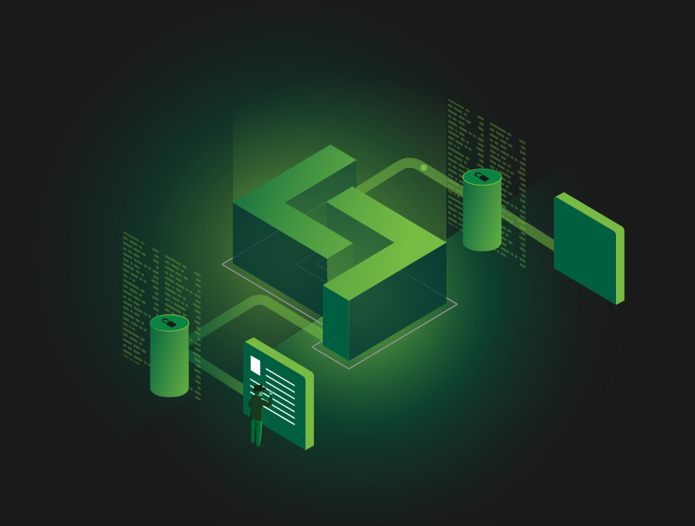
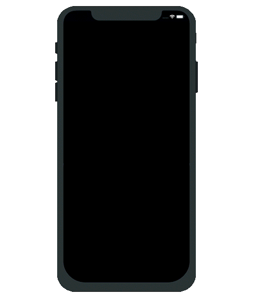

<link rel="stylesheet" type="text/css" href="https://www.loki.network/asciinema-player.css" />
<h2>紹介</h2>

    

        

            

                プライバシーとは、いつどのように個人情報を公開するかを決める能力です。人の個人情報は例がないほどに収集、保存されている現在の世界では、プライバシーは特に重要です。
                  
                Lokiは分散型のブロックチェーン技術を利用して、インターネットと新たな接続する方法を構築するによって、ユーザーに匿名に、そしてプライベートにオンラインで交流するためのツールを提供します。
            

        

        <h2>ダウンロード</h2>
        

            

                <h3>セッション</h3>
                

                    <a href="https://github.com/loki-project/loki-messenger/releases" class="button button-outline">デスクトップ</a>
                

                

                    <a href="https://github.com/loki-project/loki-messenger-android/releases" class="button button-outline">アンドロイド</a>
                

                

                    <a href="https://github.com/loki-project/loki-messenger-ios/releases" class="button button-outline">iOS</a>
                

                <h3>ウォレット</h3>
                

                    <a href="https://github.com/loki-project/loki-electron-gui-wallet/releases" class="button button-outline">GUI版</a>
                

                

                    <a href="https://github.com/loki-project/loki/releases" class="button button-outline">CLI版</a>
                

                

                    <a href="https://github.com/loki-project/loki-android-wallet/releases" class="button button-outline">アンドロイド版</a>
                

                

                    <a href="https://github.com/loki-project/loki-ios-wallet/releases" class="button button-outline">iOS版</a>
                

            

            

                <h3>Lokinet</h3>
                

                    <a href="https://github.com/loki-project/loki-network/releases" class="button button-outline">デスクトップ</a>
                

            

        

    

    

        
    

    <video width="1000" poster="assets/AssetsChina/thumbnail.PNG" controls>
    <source src="assets/AssetsChina/ChinaThisIsLokiHardSubs.webm"  type="video/webm">
        Your browser does not support the video tag.
    </video>

 

<h2 id="loki">Lokiとは？<a class="headerlink" href="#loki" title="Permanent link">&para;</a></h2>

LokiはTorと同じようなプライバシーソフトウェアです。オンライン活動をよりプライベートそして匿名にするという点で、Torに似ています。Lokiを使用すると、訪れるウェブサイトに追跡されにくくなり、端末からの接続も監視されにくくなります。  

そしてさらに、Torと同じように、Lokiには普通のインターネット（クリアネット）よりプライベートな内部ネットワーク（ダークネット）を持ちます。ユーザーがクリアネットよりプライベートなウェブサイトやチャットルームをLokiの内部ネットワークに作ることができます。  

Lokiには、プライバシーと匿名性を守るため自体の内部ネットワークを利用する「セッション」というメッセンジャーアプリもあります。  

<h2>LokiはTorと何が違いますか？</h2>

LokiはTorに似ていますが、1つの大きな違いがあります。LokiはTorの最大の問題を解決するために開発されました。まずはその問題を説明して、そしてLokiの解決策について述べましょう。  

TorとLoki両方は、正常に機能するために世界中のサーバー（ノード）が必要です。Torの場合、誰でもコストゼロでノードを管理できます。その良い点は、ノードの世界中の大型ネットワークを作りやすくなります。しかし逆に、その欠点は悪意のある人々でも簡単にノードを設定できてしまうことです。悪意のあるTorノードはユーザーたちを監視でき、ネットワークにダメージを与えれます。誰でも簡単にノードを設定できるからこそ、悪意のある人々が簡単に悪意ノードのネットワークも作れます。  

Lokiの場合、ノードの設定には一定の電子マネー（仮想通貨）の投資を必要とすることで問題を解決しようとしています。ノード管理者はまだ匿名のまま、そしてLokiはもちろんフリー・オープンソース・ソフトウェアですが、管理者はノードを設定する前に電子マネー（仮想通貨）の投資を固定しなければなりません。その後、管理者はノード運用と引き換えに電子マネー（仮想通貨）を稼ぐこともできます。  

Lokiに悪意ノードは作られることがまだできますが、ノードを設定するには投資が必要なので悪意ノードの大型ネットワークを簡単に作れません。つまり、ユーザーたちを監視し、ネットワークにダメージを与えることは難しくなります。その上、悪意ノード管理者が発見されたらネットワークから追い出されて、ノード運用で稼ぐことができなくなります。  

言い換えれば、ノード設定の財務コスト、そしてノード運用で稼ぐ可能性は悪意ノードの管理を思いとどまらせて、ネットワークに役立つ行為を助長します。  

<h2>Lokiは有料ですか？</h2>

いいえ。Lokiはフリー・オープンソース・ソフトウェアだからこそ、ユーザーは無料で使えます。ノード管理者のみは電子マネーについて考えなければなりません。  

    

        <h3>信使</h3>
        

            
        

        

            Loki Messenger是适用于所有平台的去中心化私人消息传递应用程序。 匿名和无懈可击的消息传递应用程序让您高枕无忧。
        

    

    

        <h3>服务节点</h3>
        

            
        

        

            服务节点是Loki网络的核心，并通过其贡献获得可观的经济回报。 使用服务节点，您可以实现托管服务，运行SNApp和浏览Lokinet。再让互联网变得更加私密的过程中获得盈利。 
              
            <a href="https://github.com/loki-project/loki-docs/blob/master/docs/ServiceNodes/SNFullGuide.md"> 查看服务节点指南以托管您自己的服务节点。</a>
        

    
  
    

        <h3>洛基网络</h3>
        

            
        

        

            独特的Lokinet由区块链强制实施和激励的洋葱路由网络，您可以在其中匿名浏览互联网，访问和托管私人网站，而无需暴露您的身份或IP地址。 
              
            <a href="https://github.com/loki-project/loki-docs/blob/master/docs/Lokinet/LokinetOverview.md">查看Lokinet概述以了解更多信息。</a>
        

    

    

        <h3>服务节点应用程序</h3>
        

            
        

        

            SNApps（服务节点应用程序）允许在Lokinet内托管隐藏的私有Web应用程序。 借助SNApp，您可以建立反审查的社交媒体平台，新闻站点，市场和其他社区，这种可能性是无止境的。
              
            <a href="https://github.com/loki-project/loki-docs/blob/master/docs/Lokinet/Guides/PublicTestingGuide.md">查看公共测试指南以托管自己的SNApp。</a>
        

    
      

 
 

<h2 id="_1">信使<a class="headerlink" href="#_1" title="Permanent link">&para;</a></h2>

    

        

            Loki Messenger不会像其他Messenger那样连接到中央服务器，而是连接到协作服务节点组（“集群”），它们在存储消息的同时实现了高度冗余，即使在离线时也避免了消息的丢失。
              
            Loki Messenger提供了一种新的在线通信方式，可确保用户的最佳性能和安全性，同时为连接区块链技术和Loki Messenger传送解决方案提供了可靠的使用案例。
              
        

        
    

    

        
    

 
 

<h2 id="_2">服务节点<a class="headerlink" href="#_2" title="Permanent link">&para;</a></h2>

    

        

            Loki的大部分网络功能和延展性是由一组称为服务节点的激励节点来实现的。 为了操作服务节点，运营商会定时锁定大量的Loki，并为网络提供最小级别的带宽和存储。 作为其服务的回报，Loki服务节点运营商将从每个区块中获得一部分区块奖励。
              
            这样的网络可提供基于市场的Sybil攻击抵御能力，从而解决了现有混合网和以隐私为中心的服务所带来的一系列问题。 这种抵制基于供求互动关系，有助于防止单个参与者在Loki中拥有过大的股份，从而对Loki提供的第二层隐私服务产生巨大负面影响。 DASH首先提出了可以从加密经济学推论Sybil抗攻击网络的理论。 当进攻者购买Loki，现存流通供应减少，反而施加需求侧压力，推动Loki的价格上涨。 随着这种情况的继续，额外Loki的购买变得越来越昂贵，这使攻击变得非常昂贵。
              
            为了实现这种经济保护，loki鼓励积极抑制现存的流通供应。特别是曲线发行和附加要求必须设计为确保足够的流通供应被锁定，并为节点运营商提供合理的回报，以确保抵御Sybil的攻击。
        

    

    

         
    

 
 

<h2 id="_3">洛基网络<a class="headerlink" href="#_3" title="Permanent link">&para;</a></h2>

    

        

            通过Lokinet传输的所有数据都是经过加密的，并通过隐藏真实来源的多个节点进行跳转。
您的真实IP地址不会泄露给Loki网络地址网络。在Loki网络中使用Loki硬币提供了可选择的升级，但Loki网络的的核心功能是免费的。
              
            Lokinet中的路由不依赖于任何单一服务器，从而使其具有抵御攻击的能力，并且互联网服务提供商无法阻止您在Lokinet上访问您的网站。与VPN不同，您不需要依赖单一服务器，因为Lokinet使用洋葱路由网络。
              
            支持Windows、Linux和Mac平台上的任何主流浏览器。
        

    

    

         
    

 
 

<h2 id="_4">服务节点应用程序<a class="headerlink" href="#_4" title="Permanent link">&para;</a></h2>

    

        

            SNApps的功能类似于Tor中发展的所谓隐藏服务。 它们为用户提供了一种在混合网络环境中进行完全交互的方式，从而提供了比访问外部主管内容更高的匿名度。 SNApps允许用户在自己的机器或服务器上建立和托管市场，论坛，举报网站，社交媒体和大多数其他互联网应用程序，同时保持全服务器和用户端的匿名。 这极大地扩展了网络范围，并允许用户在Loki网络中建立重要的社区。
              
            SNApp运营商使用传统的服务器-客户端模型，主要区别在于服务节点将成为通过洛基网络与用户连接的中介。 当SNApp希望在网络上注册时，它必须使用其描述符更新DHT。 此描述符包含各种导入器，这些导入器是用户可以联系以形成SNApp路径的特定服务节点。 设置这些路径后，用户可以连接到SNApp，而无需任何一方知道对方在网络中的位置。
        

    

    

         
    

